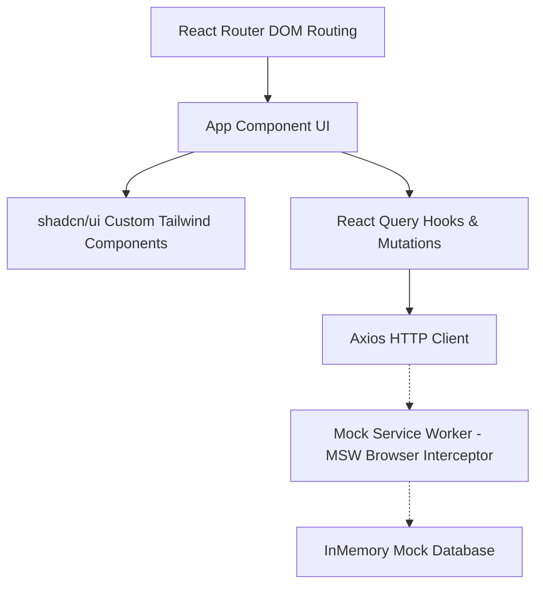

# Employee Dashboard

A polished, responsive, and high-performing **Employee Dashboard** application built with **React**, **TypeScript**, **Tailwind CSS**, and **TanStack React Query**. The application features client-side API mocking via **Mock Service Worker (MSW)** and incorporates an AI-driven announcement summarization feature.

---

## 🚀 Key Features

- **📊 Dashboard Overview**: A central hub showing daily summaries (total employees, present today, pending leaves), quick actions, and recent announcements.
- **📅 Daily Attendance Records**: Comprehensive tabular attendance tracker with colored status indicators (Present, Late, Absent, On Leave).
- **🌴 Leave Request & Summary**: Balance counters (*Total, Used, Remaining*) with a request submission form. Responsive styling displays form inline on desktop and opens in an elegant modal on mobile.
- **🔍 Team Directory**: Searchable directory filtered by name and department, with full state synchronization in the browser's URL query parameters (`?q=...&dept=...`) for shareable search states.
- **📢 Announcements & AI Summarizer**: Company feed with a "Summarize with AI" button that generates a key bullet-point summary of long posts using a simulated REST AI endpoint.
- **🌓 Light / Dark Mode Toggle**: Persistent theme switcher that syncs with `localStorage` and respects the user's OS-level preferred color scheme (`prefers-color-scheme`).
- **📱 Native-Like Mobile Layout**: Responsive navigation layout that transforms from a desktop sidebar to a fixed bottom icon navigation bar on smaller viewports.

---

## 🏗️ System Architecture

The application is structured as a decoupled SPA (Single Page Application) with clear boundaries:



### 1. View & UI Layer
- **Vite & React 19 + TypeScript**: Offers fast Hot Module Replacement (HMR) and compile-time type-safety.
- **Tailwind CSS**: Modern utility classes built exclusively on standard design tokens (`text-xs`, `min-h-20`, `max-w-48`) without arbitrary values to preserve stylesheet cleanliness.
- **shadcn/ui Default Components**: Standard components ([table.tsx](file:///Users/vickyadifirmansyah/Documents/Projects/employee-dashboard/src/components/ui/table.tsx), [card.tsx](file:///Users/vickyadifirmansyah/Documents/Projects/employee-dashboard/src/components/ui/card.tsx), [button.tsx](file:///Users/vickyadifirmansyah/Documents/Projects/employee-dashboard/src/components/ui/button.tsx), [input.tsx](file:///Users/vickyadifirmansyah/Documents/Projects/employee-dashboard/src/components/ui/input.tsx)) mapped to standard theme classes (e.g. `border-border`) to ensure contrast accessibility.

### 2. State & Cache Layer
- **React Router DOM v6**: Powers page routing (`/overview`, `/attendance`, `/leaves`, `/directory`, `/announcements`) and handles fallback redirection on unregistered paths.
- **TanStack React Query v5**: Manages asynchronous server cache, polling, query caching, loading indicators, and mutation side-effects (such as automatically invalidating leave requests or AI summaries).
- **Axios client**: Configured with a default base URL to centralize API requests.

### 3. Server Mocking Layer
- **Mock Service Worker (MSW)**: Registers a Service Worker interceptor on `mockServiceWorker.js`. It catches all outgoing Axios API requests and responds with mock payload data, eliminating the need to spin up or host a separate backend server.

---

## 🛠️ Setup & Installation

### Prerequisites
Make sure you have [Node.js](https://nodejs.org/) (v18+) and [pnpm](https://pnpm.io/) (or `npm`) installed.

### Steps
1. **Clone the repository**:
   ```bash
   git clone <repository-url>
   cd employee-dashboard
   ```

2. **Install dependencies**:
   ```bash
   pnpm install
   ```

3. **Start the local development server**:
   ```bash
   pnpm run dev
   ```
   Open your browser and navigate to `http://localhost:5173/overview`.

4. **Build for production**:
   ```bash
   pnpm run build
   ```
   The compiled assets will be outputted to the `dist/` directory.

---

## 🤖 AI Integration

The **"Summarize with AI"** feature utilizes an asynchronous mock endpoint `/api/announcements/:id/summarize`. 
- When triggered, it simulates a LLM (Large Language Model) call returning a structured array of key takeaways.
- On mobile viewports, the button is designed to hide its text label (`hidden md:inline`) to display only the Sparkles icon, ensuring long announcement titles do not wrap and the layout remains balanced.
- The developer experience and responsive layout adjustments were built in partnership with **Antigravity AI** (Google Mind/DeepMind).

---

## 🧠 Assumptions & Trade-offs

### 1. Data Persistence (In-Memory Mock)
* **Assumption**: A client-side demonstration does not need database persistence.
* **Trade-off**: MSW database states are maintained in browser memory. Reloading the application resets mock states (e.g., newly added leave requests will disappear). This is a standard trade-off for zero-dependency local setups.

### 2. URL State Synchronization
* **Assumption**: Users should be able to bookmark and share directory search queries and department filters.
* **Trade-off**: We map the state of input fields directly to the browser search parameters. This adds minimal overhead to input typing handlers (as it pushes history/URL state updates), but significantly improves the shareability and UX of the dashboard.

### 3. Standard Design System vs Custom Sizes
* **Assumption**: Arbitrary Tailwind sizes (like `text-[10px]`) are code smells that complicate maintenance.
* **Trade-off**: We replaced all arbitrary sizing tokens with Tailwind standard equivalents. This restricts micro-sizing control but ensures full compliance with design system guidelines and keeps output files lean.
